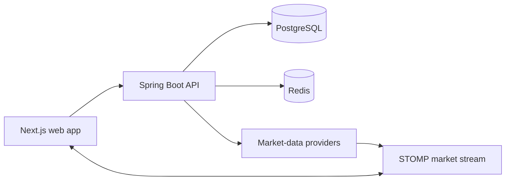

<p align="center">
  <a href="https://stoxsim.com">
    
  </a>
</p>

<h1 align="center">StoxSim</h1>

<p align="center">
  <strong>Learn stock trading. Risk no real money.</strong>
</p>

<p align="center">
  A beginner-friendly paper-trading simulator for Indian and United States markets.
</p>

<p align="center">
  <a href="https://stoxsim.com"><strong>Launch StoxSim →</strong></a>
  ·
  <a href="https://stoxsim.com/learn-stock-trading">Learn how it works</a>
  ·
  <a href="https://stoxsim.com/status">Service status</a>
</p>

<p align="center">
  <a href="https://stoxsim.com"></a>
  <a href="https://github.com/M4Rk9/stoxsim/releases/latest"></a>
  <a href="https://github.com/M4Rk9/stoxsim/actions/workflows/ci.yml"></a>
  <a href="LICENSE"></a>
</p>

---

## Practise markets before risking money

[StoxSim](https://stoxsim.com) helps new investors understand how research, orders, holdings and portfolio performance fit together. Learners receive separate virtual accounts for India and the United States, explore stocks and ETFs, place simulated orders and review the outcome of every decision.

No brokerage account, deposit or real-money trade is required.

> [!IMPORTANT]
> StoxSim is an educational simulator—not a broker, exchange or investment adviser. Market data may be delayed, stale, incomplete or unavailable, and simulated performance does not predict real-world results.

## Product highlights

| Explore | Practise | Improve |
|---|---|---|
| Search Indian and US stocks and ETFs | Submit simulated market and limit orders | Review holdings, returns and allocation |
| Follow indices, market sessions and movers | Learn with separate INR and USD portfolios | Use StoxScore and post-trade feedback |
| Study interactive charts and company fundamentals | Build persistent watchlists | Complete learning missions and track progress |

Additional learning tools include weekly portfolio reports, beginner onboarding, opt-in competitions, private leagues, explainable analytics and light/dark appearance modes.

## Two markets, separate practice portfolios

| 🇮🇳 India | 🇺🇸 United States |
|---|---|
| ₹5,00,000 virtual starting capital | $10,000 virtual starting capital |
| NSE equities and ETFs | NASDAQ and NYSE equities and ETFs |
| NIFTY 50, SENSEX and sector indices | S&P 500, NASDAQ-100 and Dow |
| Indian market sessions and simulated charges | US market sessions and simulated fees |

Learn more about the [free paper-trading simulator](https://stoxsim.com/paper-trading), explore the [Indian stock-market simulator](https://stoxsim.com/stock-market-simulator-india), or follow the [beginner learning path](https://stoxsim.com/learn-stock-trading).

## How the learning loop works

1. **Choose a market** — open the India or US virtual portfolio.
2. **Research an instrument** — inspect the available quote, chart and company information.
3. **Form a reason** — decide why a simulated trade makes sense before submitting it.
4. **Place the paper trade** — use virtual capital and review the estimated charges.
5. **Review the outcome** — examine portfolio analytics and improve the process.

<p align="center">
  <a href="https://stoxsim.com"><strong>Create a free StoxSim account</strong></a>
</p>

## Technology

- **Backend:** Java 21, Spring Boot 4.1, PostgreSQL, Flyway and Redis
- **Frontend:** Next.js 16, React 19 and TypeScript
- **Market connectivity:** provider-backed India and US market-data integrations with STOMP WebSocket updates
- **Infrastructure:** Docker Compose, Caddy and an Ubuntu production host
- **Quality:** Testcontainers, Playwright, GitHub Actions, CodeQL and dependency review
- **Operations:** structured logs, Prometheus, Grafana, uptime probes and encrypted off-host backups

## Run StoxSim locally

### Requirements

- Docker with Docker Compose
- Git

### Start the application

```bash
git clone https://github.com/M4Rk9/stoxsim.git
cd stoxsim
cp .env.example .env
docker compose up --build
```

Local services:

- Web application: `http://localhost:3000`
- API status: `http://localhost:8080/api/v1/system/status`
- API health: `http://localhost:8080/actuator/health`

Set `UPSTOX_ANALYTICS_TOKEN` to enable supported Indian quotes and company fundamentals. Set `UPSTOX_STREAM_ENABLED=true` to allow resting limit and queued orders to react to market ticks. Consult the deployment and market-data documentation before exposing an environment publicly.

## Platform architecture



The backend owns authentication, virtual accounts, order validation, simulated execution, portfolio accounting, learning progression and market-provider contracts. The frontend provides the learner journey, research workspace and portfolio experience.

## Documentation

### Product and learning

- [Product definition](docs/PRODUCT.md)
- [Feature implementation roadmap](docs/ROADMAP_IMPLEMENTATION.md)
- [StoxScore portfolio structure model](docs/STOXSCORE.md)
- [Portfolio allocation and attribution](docs/PORTFOLIO_ANALYTICS.md)
- [Weekly portfolio reports](docs/WEEKLY_PORTFOLIO_REPORTS.md)
- [Learning progression](docs/LEARNING_PROGRESSION.md)
- [Competitions and private leagues](docs/COMPETITIONS.md)

### Engineering and operations

- [System architecture](docs/ARCHITECTURE.md)
- [Authentication and account lifecycle](docs/AUTHENTICATION.md)
- [Instruments and market data](docs/INSTRUMENTS.md)
- [India paper-trading engine](docs/TRADING.md)
- [Simulated Indian charges](docs/CHARGES.md)
- [Testing and acceptance](docs/TESTING.md)
- [Production deployment](docs/DEPLOYMENT.md)
- [Operations and incident response](docs/OPERATIONS.md)
- [Public release checklist](docs/RELEASE_CHECKLIST.md)

### Provider and compliance controls

- [Upstox market-data integration](docs/MARKET_DATA.md)
- [Market-data public-release permission gate](docs/MARKET_DATA_PERMISSION.md)
- [SEC EDGAR access and attribution review](docs/SEC_EDGAR_COMPLIANCE.md)

## Production

The public release is available at **[stoxsim.com](https://stoxsim.com)**. Production uses HTTPS, isolated PostgreSQL and Redis services, immutable image deployment, protected release workflows, verified rollback procedures, private monitoring and encrypted off-host backups.

Operational health is published on the [StoxSim status page](https://stoxsim.com/status).

## Contributing

Bug reports and focused improvement proposals are welcome through [GitHub Issues](https://github.com/M4Rk9/stoxsim/issues). Please review the relevant architecture and testing documentation before proposing implementation changes.

## License

StoxSim is available under the [MIT License](LICENSE).
